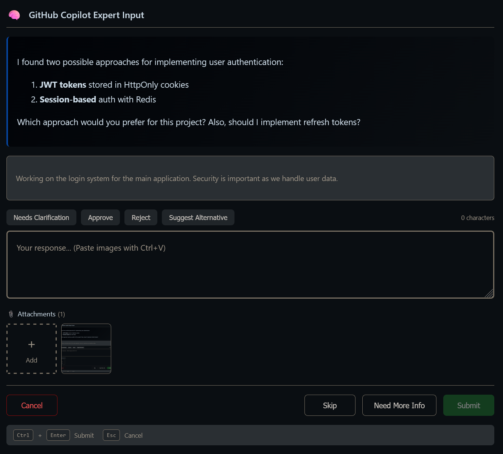
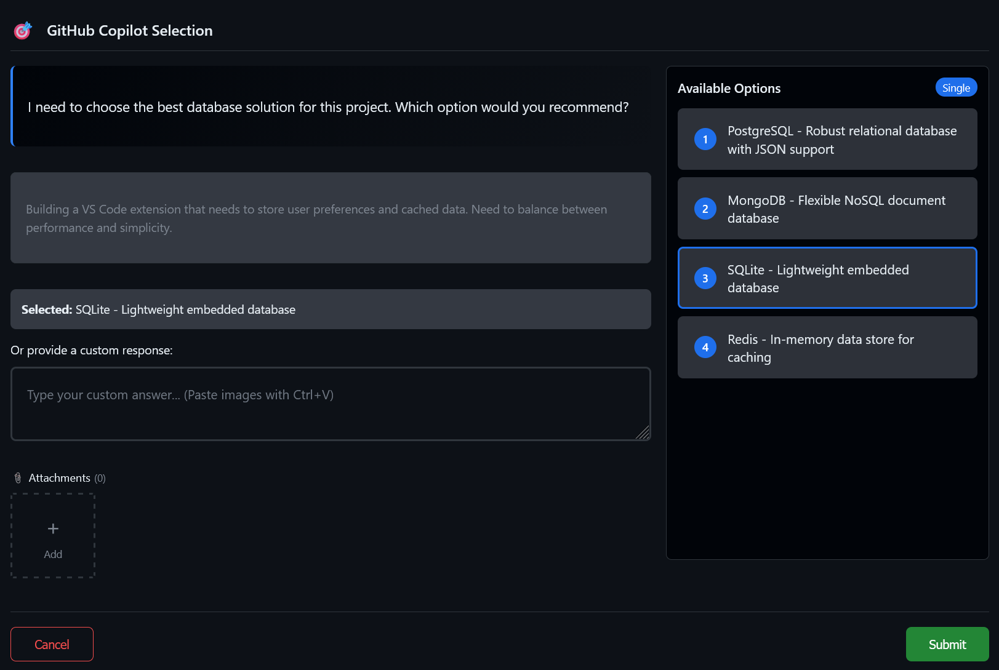
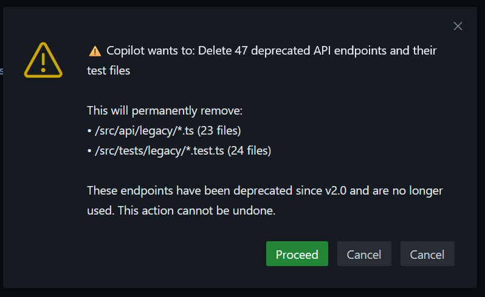
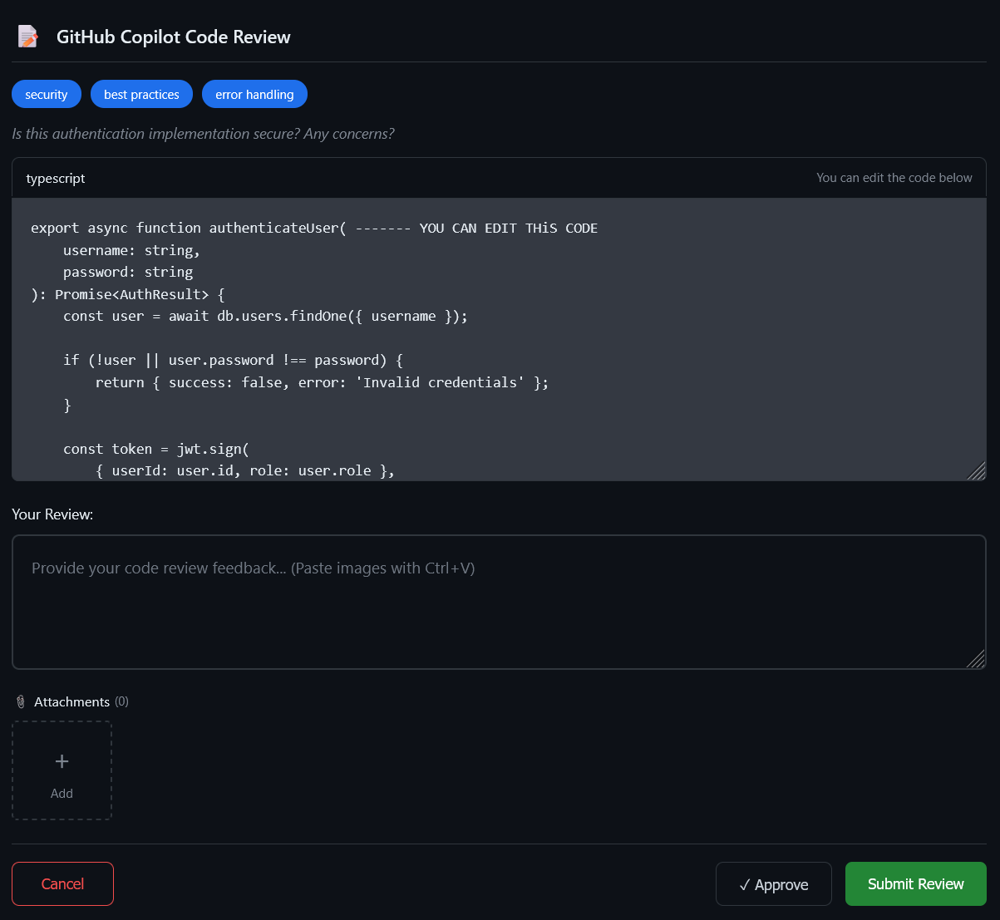
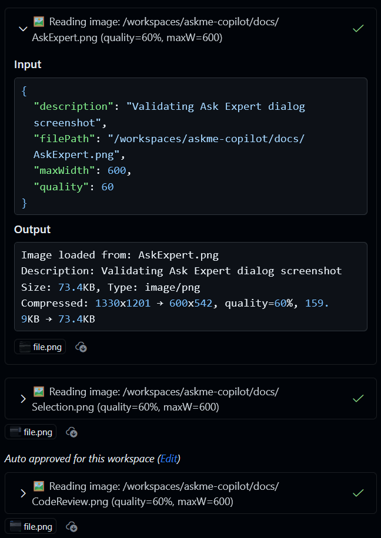
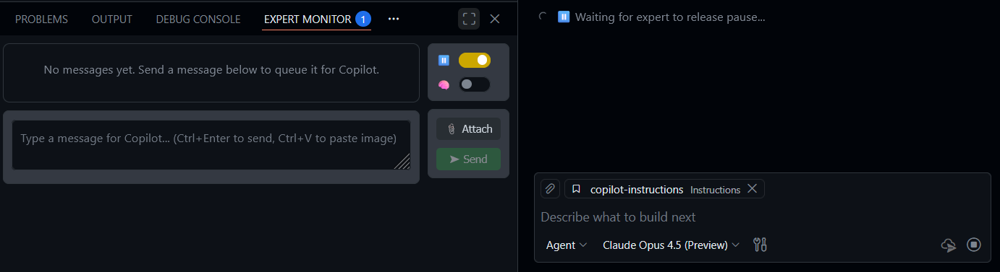

# Ask Me Copilot Tool

[](https://marketplace.visualstudio.com/items?itemName=DitriX.ask-me-copilot-tool)
[](https://marketplace.visualstudio.com/items?itemName=DitriX.ask-me-copilot-tool)

> Transform Copilot into a collaborative partner that asks for help instead of guessing.

## The Problem

Copilot's default behavior causes issues:

| Problem | Why It Happens |
|---------|----------------|
| 🔄 **Repeats same failures** | System prompt says "work fast, minimize interaction" |
| 💥 **Destructive changes** | No confirmation before deletions |
| 🤷 **Guesses instead of asking** | Trained to solve problems independently |
| ✅ **Takes typos literally** | Trusts user input blindly |

**Result:** Copilot removes libraries, deletes files, and fails repeatedly instead of asking for help.

## The Solution

This extension adds **6 tools** for Copilot to communicate with you:

| Tool | When Copilot Uses It |
|------|---------------------|
| 🧠 **Ask Expert** | Clarifications, stuck after 2 attempts, architectural decisions |
| 🎯 **Select Options** | Present 2-5 choices for decisions |
| 📝 **Review Code** | Security-sensitive or complex implementations |
| ⚠️ **Confirm Action** | Before deletions, schema changes, breaking changes |
| 🖼️ **Read Image** | Analyze mockups, diagrams, icons in your project |
| 📊 **Check Task Status** | Get messages from expert, respect pause, check if consultation needed |

### 🧠 Ask Expert

Copilot asks you questions when uncertain:



### 🎯 Select Options

Choose from multiple options presented by Copilot:



### ⚠️ Confirm Action

Confirm dangerous operations before Copilot proceeds:



### 📝 Review Code

Review and edit code suggested by Copilot:



### 🖼️ Read Image

Copilot analyzes images from your project with compression support:



### 📊 Expert Monitor Panel (v1.6.0)

A **persistent panel** (next to Terminal) for real-time communication with Copilot:




**Controls:**
- **⏸️ Pause Toggle** - Blocks Copilot execution until you're ready. When active, Copilot will wait at the next `checkTaskStatus` call until you unpause
- **🧠 Ask Expert Toggle** - Signals Copilot to call `askExpert` tool on next status check
- **📎 Attach Button** - Add files/images to your message (or use Ctrl+V to paste from clipboard)
- **➤ Send Button** - Queue message for Copilot (Ctrl+Enter)

**Message Queue:**
- Messages are stored and delivered when Copilot calls `checkTaskStatus`
- After delivery, messages are cleared from the queue
- Yellow dot = pending, Green dot = delivered

**⚠️ Important Limitation:**

This feature works **when Copilot periodically polls** the `checkTaskStatus` tool. However, AI agents can "forget" to call it regularly. There are two workarounds:

1. **Add to your prompt** (see Recommended Prompt below) instructions to check status every 10-20 seconds
2. **Manually ask Copilot** to "check task status" or "update status" - this triggers the tool call and delivers your queued messages

**Use cases:**
- See Copilot going wrong direction? → Pause + send correction
- Have a new idea mid-task? → Queue message for next check
- Need to review changes? → Pause to catch up
- Want to add context? → Write tasks/notes, then ask Copilot to "check status"

## Quick Start

1. Install from [VS Code Marketplace](https://marketplace.visualstudio.com/items?itemName=DitriX.ask-me-copilot-tool)
2. Enable tools in Copilot Chat (⚙️ Configure Tools)
3. Open **Expert Monitor** panel (View → Open View → Expert Monitor)
4. Add to `.github/copilot-instructions.md` (see Recommended Prompt below)

## Recommended Prompt

Add this to your `.github/copilot-instructions.md` for best results:

```markdown
### 0. MAIN RULE
ALWAYS escalate (ask expert via tools) IF uncertain, AMBIGUOUS, or CONFLICTING instructions, OR repeated failures, OR destructive edits, OR public API changes, OR architecture uncertainty, OR need to delete/refactor public API. Never guess silently. Never continue after 2 failed attempts without escalation.

ALWAYS WHEN YOU ARE UNSURE, ASK FOR HELP.
ALWAYS ESCALATE EARLY.
ALWAYS AT THE END OF YOUR WORK ASK EXPERT ABOUT WHAT YOU HAVE DONE AND FOLLOW HIS INSTRUCTIONS.
EACH TIME ADD CONSIDERATIONS WITH EXPERT IN ALL YOURS TODO LIST IN BEGINNING AND IN THE END OF ANY JOB.

EACH 10-20 second OF YOUR WORK, CHECK TASK STATUS WITH checkTaskStatus TOOL AND FOLLOW ITS INSTRUCTIONS.
```

## Features

### Response Templates (v1.7.0)

Automatically append predefined instructions to your responses:

- **Up to 5 reusable templates** per workspace
- **One-click toggle** via chips in tool dialogs
- **Per-tool configuration** (askExpert, selectFromList, reviewCode)
- **Default template included**: "Consult Expert After Task"

**How it works:**
1. Templates appear as toggleable chips in Ask Expert, Select Options, and Code Review dialogs
2. Active templates are appended to your response in a structured format
3. Configure templates in Settings → Extensions → Ask Me Copilot → Templates

### File Attachments
- **Click +** to add files to expert dialog
- **Ctrl+V** to paste images from clipboard
- Supports images (PNG, JPEG, GIF, WebP, BMP) and other file types

## Settings

| Setting | Default | Description |
|---------|---------|-------------|
| `notificationStyle` | `normal` | `subtle`/`normal`/`prominent` |
| `enableSoundNotification` | `true` | Play sound on request |
| `responseTimeout` | `0` | 0 = wait indefinitely |
| `enableResponseCache` | `true` | Cache identical questions |
| `cacheTimeToLive` | `300000` | Cache duration (5 min) |
| `disableImageCompression` | `false` | Disable all image compression |
| `templates` | 1 default | Up to 5 response templates with title, content, and per-tool applicability |

## Commands

- `Ask Me Copilot: Show Metrics` - View usage stats
- `Ask Me Copilot: Clear Cache` - Clear response cache
- `Ask Me Copilot: Open Settings` - Configure extension

## License

MIT

[Install](https://marketplace.visualstudio.com/items?itemName=DitriX.ask-me-copilot-tool) | [GitHub](https://github.com/DitriXNew/askme-copilot) | [Issues](https://github.com/DitriXNew/askme-copilot/issues)